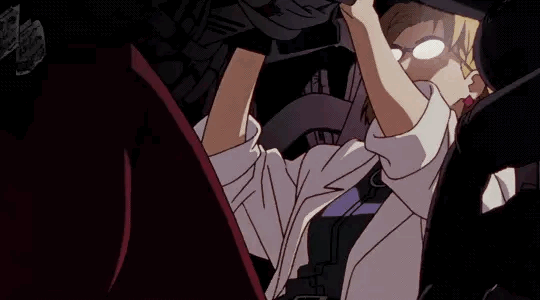

<h1 align="center">Hi, I'm Overocai 👋</h1>

  20 y/o · I build <b>unofficial plugins for Equicord</b> — a Discord client mod. 
  Mostly with <b>TypeScript</b>, sometimes with <b>React</b>.

  
  
  
  
  

  

---

## 🧩 My Plugins

- **[CustomStreamPreview](https://github.com/Overocai/CustomStreamPreview)** — blocks Discord's stream thumbnail capture and optionally replaces it with a custom image.
- **[spotify-rich-presence-pp](https://github.com/Overocai/spotify-rich-presence-pp)** — a futuristic, fully customizable Spotify player for Discord with smooth animations, real-time waveform visualization, BPM & key detection and animated album covers.
- **[autoLeaveBlacklistVoice-Plugin](https://github.com/Overocai/autoLeaveBlacklistVoice-Plugin)** — automatically leaves voice calls when a blacklisted user joins or is already present. Works in guild channels, DMs and Group DMs.
- **[VoiceServerInfo](https://github.com/Overocai/VoiceServerInfo)** — monitors voice and screen-share server IPs in real time.
- **[stereo-plugin](https://github.com/Overocai/stereo-plugin)** — enables stereo microphone transmission on Discord with live bitrate control and a quick-access button in the voice panel.
- **[fake-moderator](https://github.com/Overocai/fake-moderator)** — adds local-only moderation entries (ban/kick/timeout/warn + mute/deafen) to the user context menu, styled exactly like Discord's real ones. Purely cosmetic — nothing is ever sent to Discord.

> All built for **[Equicord](https://github.com/Equicord/Equicord)** / **[Vencord](https://github.com/Vendicated/Vencord)**.

---

## 📫 Connect

  

